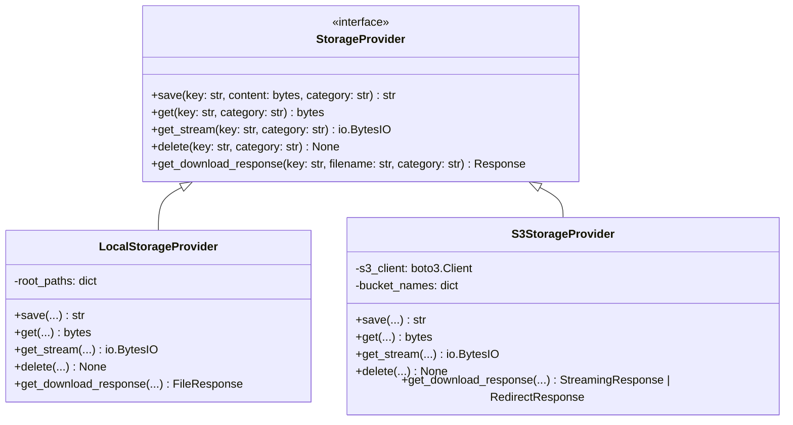

# Propuesta de Arquitectura: Desacoplamiento y Multi-Proveedor de Almacenamiento de Documentos

Este documento presenta el análisis y la propuesta de diseño para independizar el almacenamiento de los archivos PDF generados (emisiones) y los PDF estáticos utilizados como contenidos de plantilla. Actualmente, el sistema está acoplado al sistema de archivos local (File System), lo que dificulta la escalabilidad horizontal y el despliegue en entornos cloud modernos.

---

## 1. Análisis del Estado Actual

En la implementación actual, los archivos PDF se gestionan directamente a través de llamadas de bajo nivel a la API de sistema de archivos de Python (`os`, `pathlib`, `open`), distribuidos en varios componentes del backend:

### Puntos de Acoplamiento Clave:
1. **Carga de PDFs Estáticos (`app/services/content_storage.py`):**
   - Usa `stored_path.write_bytes(stored_bytes)` para escribir en el disco local bajo la ruta de configuración `settings.content_storage_root`.
   - Retorna la ruta absoluta del archivo en disco (`str(stored_path)`), la cual se almacena en el campo `stored_path` de la tabla `static_pdf_assets`.
2. **Descarga de PDFs Estáticos (`app/api/static_pdfs.py`):**
   - Retorna un `FileResponse(Path(asset.stored_path))` leyendo de la ruta de almacenamiento local absoluta.
3. **Composición de PDF final (`app/services/pdf_generator.py`):**
   - Usa `PdfReader(stored_path)` para cargar los activos estáticos del disco local y combinarlos con el PDF generado dinámicamente.
4. **Generación de Emisiones (`app/api/document_designs.py`):**
   - El endpoint `/api/document-designs/{design_id}/generate` genera los bytes del PDF dinámico y ejecuta un bloque `with open(file_path, "wb") as f: f.write(pdf_bytes)` escribiendo en `settings.issuance_storage_root`.
   - Guarda el path absoluto en la base de datos dentro del campo `file_path` de la tabla `document_issuances`.
5. **Descarga de Emisiones (`app/api/issuances.py`):**
   - Usa `FileResponse(Path(issuance.file_path))` para servir el documento definitivo.

### Limitaciones del Estado Actual:
* **Escalabilidad Horizontal:** Si múltiples réplicas del Backend se ejecutan detrás de un balanceador de carga, requerirán un volumen compartido (NFS, GlusterFS) montado de forma síncrona en todas las réplicas, lo que introduce complejidad e ineficiencia.
* **Seguridad y Resiliencia:** El almacenamiento local carece de características avanzadas de ciclo de vida (archivar, expirar), control fino de acceso (URLs prefirmadas) y replicación geográfica nativa que ofrecen los servicios cloud.
* **Acoplamiento de Base de Datos:** Guardar rutas absolutas (como `D:\...` o `/app/.content-storage/...`) en la base de datos ata las filas de las tablas a la topología interna de una máquina específica.

---

## 2. Arquitectura Propuesta

Se propone introducir un **Patrón Proveedor (Provider Pattern)** mediante una interfaz abstracta que encapsule las operaciones de entrada/salida de archivos. De esta forma, el backend consume una abstracción unificada y la implementación física se define por configuración.



### Abstracción de Operaciones:
Definiremos una categoría (`category`) para distinguir entre contenidos estáticos (`static_pdfs`) y emisiones generadas (`issuances`). Esto nos permite usar diferentes directorios físicos locales, o diferentes buckets de S3 para cada propósito.

---

## 3. Especificación Técnica de los Componentes

### A. Interfaz Abstracta (`app/services/storage/base.py`)
```python
from abc import ABC, abstractmethod
import io
from fastapi import Response

class StorageProvider(ABC):
    @abstractmethod
    def save(self, key: str, content: bytes, category: str) -> str:
        """Persiste el contenido y devuelve la referencia/URI final."""
        pass

    @abstractmethod
    def get(self, key: str, category: str) -> bytes:
        """Obtiene el contenido binario del archivo."""
        pass

    @abstractmethod
    def get_stream(self, key: str, category: str) -> io.BytesIO:
        """Obtiene un flujo de bytes (file-like object) para procesamiento en memoria (ej. PyPDF)."""
        pass

    @abstractmethod
    def delete(self, key: str, category: str) -> None:
        """Elimina el recurso en el almacenamiento."""
        pass

    @abstractmethod
    def get_download_response(self, key: str, filename: str, category: str) -> Response:
        """Devuelve un objeto Response optimizado para FastAPI (FileResponse, StreamingResponse o Redirect)."""
        pass
```

### B. Proveedor Local (`app/services/storage/local.py`)
Esta implementación mantendrá la compatibilidad actual usando el disco local del contenedor o servidor.
```python
import io
import os
from pathlib import Path
from fastapi.responses import FileResponse
from app.services.storage.base import StorageProvider

class LocalStorageProvider(StorageProvider):
    def __init__(self, root_paths: dict[str, str]):
        self.root_paths = root_paths # Mapea 'static_pdfs' e 'issuances' a carpetas locales

    def _get_path(self, key: str, category: str) -> Path:
        root = self.root_paths.get(category)
        if not root:
            raise ValueError(f"Categoría de almacenamiento desconocida: {category}")
        return Path(root) / key

    def save(self, key: str, content: bytes, category: str) -> str:
        path = self._get_path(key, category)
        path.parent.mkdir(parents=True, exist_ok=True)
        path.write_bytes(content)
        return key

    def get(self, key: str, category: str) -> bytes:
        return self._get_path(key, category).read_bytes()

    def get_stream(self, key: str, category: str) -> io.BytesIO:
        return io.BytesIO(self.get(key, category))

    def delete(self, key: str, category: str) -> None:
        path = self._get_path(key, category)
        if path.exists():
            os.remove(path)

    def get_download_response(self, key: str, filename: str, category: str) -> FileResponse:
        path = self._get_path(key, category)
        return FileResponse(path, media_type="application/pdf", filename=filename)
```

### C. Proveedor S3-Compatible (`app/services/storage/s3.py`)
Diseñado para interactuar con cualquier almacenamiento compatible con la API de AWS S3 utilizando la librería `boto3`. Esto soporta **MinIO**, **Oracle Cloud Object Storage (OCI)**, AWS S3 nativo y Cloudflare R2 de forma transparente.
```python
import io
import boto3
from botocore.client import Config
from fastapi import Response
from fastapi.responses import StreamingResponse
from app.services.storage.base import StorageProvider

class S3StorageProvider(StorageProvider):
    def __init__(
        self,
        endpoint_url: str | None,
        access_key: str,
        secret_key: str,
        region_name: str | None,
        bucket_names: dict[str, str] # Mapea 'static_pdfs' e 'issuances' a buckets
    ):
        self.bucket_names = bucket_names
        self.s3 = boto3.client(
            "s3",
            endpoint_url=endpoint_url,
            aws_access_key_id=access_key,
            aws_secret_access_key=secret_key,
            region_name=region_name,
            config=Config(signature_version="s3v4")
        )

    def _get_bucket(self, category: str) -> str:
        bucket = self.bucket_names.get(category)
        if not bucket:
            raise ValueError(f"Categoría de almacenamiento desconocida: {category}")
        return bucket

    def save(self, key: str, content: bytes, category: str) -> str:
        bucket = self._get_bucket(category)
        self.s3.put_object(
            Bucket=bucket,
            Key=key,
            Body=content,
            ContentType="application/pdf"
        )
        return key

    def get(self, key: str, category: str) -> bytes:
        bucket = self._get_bucket(category)
        resp = self.s3.get_object(Bucket=bucket, Key=key)
        return resp["Body"].read()

    def get_stream(self, key: str, category: str) -> io.BytesIO:
        bucket = self._get_bucket(category)
        resp = self.s3.get_object(Bucket=bucket, Key=key)
        return io.BytesIO(resp["Body"].read())

    def delete(self, key: str, category: str) -> None:
        bucket = self._get_bucket(category)
        self.s3.delete_object(Bucket=bucket, Key=key)

    def get_download_response(self, key: str, filename: str, category: str) -> Response:
        bucket = self._get_bucket(category)
        # Opción 1: Streaming directo a través del BFF/Backend (oculta la URL del bucket)
        resp = self.s3.get_object(Bucket=bucket, Key=key)
        
        def _stream():
            yield from resp["Body"]
            
        return StreamingResponse(
            _stream(),
            media_type="application/pdf",
            headers={"Content-Disposition": f'attachment; filename="{filename}"'}
        )
        
        # Opción 2 (Alternativa si se prefiere descarga directa y rápida): RedirectResponse temporal prefirmado
        # url = self.s3.generate_presigned_url(
        #     'get_object',
        #     Params={'Bucket': bucket, 'Key': key},
        #     ExpiresIn=300
        # )
        # return RedirectResponse(url)
```

---

## 4. Cambios en Base de Datos y Modelos

Actualmente, las tablas almacenan rutas del sistema de archivos. Para independizar la infraestructura, las columnas de base de datos deben representar **claves lógicas** del objeto en lugar de directorios absolutos de un servidor.

### Migración del Modelo `StaticPdfAsset`
```diff
class StaticPdfAsset(Base):
    __tablename__ = "static_pdf_assets"
    
    id: Mapped[uuid.UUID] = mapped_column(primary_key=True, default=uuid.uuid4)
    original_filename: Mapped[str]
    stored_filename: Mapped[str]
-   stored_path: Mapped[str]  # Ej: "D:\project\.content-storage\file.pdf"
+   storage_key: Mapped[str]  # Ej: "static-assets/file.pdf" o solo el UUID
```

### Migración del Modelo `DocumentIssuance`
```diff
class DocumentIssuance(Base):
    __tablename__ = "document_issuances"
    
    id: Mapped[uuid.UUID] = mapped_column(primary_key=True)
-   file_path: Mapped[str]    # Ej: "D:\project\.content-storage\issuances\file.pdf"
+   storage_key: Mapped[str]  # Ej: "issuances/file.pdf" o solo el UUID
```

---

## 5. Cambios en la Configuración (`app/config.py` y `.env`)

Añadiremos variables de entorno para controlar qué proveedor se activa y sus credenciales asociadas.

### Nuevas Variables en `.env` (MinIO de Desarrollo local / Oracle Cloud Object Storage):
```bash
# Tipo de almacenamiento: 'local' o 's3'
STORAGE_PROVIDER_TYPE=s3

# Configuración si STORAGE_PROVIDER_TYPE=s3
STORAGE_S3_ENDPOINT_URL=http://localhost:9000  # Para MinIO. Vacío si es Oracle Cloud / AWS
STORAGE_S3_ACCESS_KEY=minioadmin
STORAGE_S3_SECRET_KEY=minioadmin
STORAGE_S3_REGION=us-east-1
STORAGE_S3_BUCKET_STATIC_PDFS=docmanagement-static-pdfs
STORAGE_S3_BUCKET_ISSUANCES=docmanagement-issuances
```

### Inicialización del Inyector de Dependencias en `app/core/dependencies.py`
Podemos exponer el proveedor activo como una dependencia inyectable de FastAPI:
```python
from functools import lru_cache
from app.config import settings
from app.services.storage.base import StorageProvider
from app.services.storage.local import LocalStorageProvider
from app.services.storage.s3 import S3StorageProvider

@lru_cache()
def get_storage_provider() -> StorageProvider:
    if settings.storage_provider_type == "s3":
        return S3StorageProvider(
            endpoint_url=settings.storage_s3_endpoint_url,
            access_key=settings.storage_s3_access_key,
            secret_key=settings.storage_s3_secret_key,
            region_name=settings.storage_s3_region,
            bucket_names={
                "static_pdfs": settings.storage_s3_bucket_static_pdfs,
                "issuances": settings.storage_s3_bucket_issuances
            }
        )
    else:
        return LocalStorageProvider(
            root_paths={
                "static_pdfs": settings.content_storage_root,
                "issuances": settings.issuance_storage_root
            }
        )
```

---

## 6. Modificaciones Clave en el Código de Negocio

### En `pdf_generator.py`:
En lugar de verificar directamente con `os.path.exists` e instanciar `PdfReader(stored_path)`, usaremos el stream obtenido desde el `StorageProvider`:

```python
# Antes:
# if not os.path.exists(stored_path):
#     raise HTTPException(...)
# reader = PdfReader(stored_path)

# Después:
storage = get_storage_provider()  # O inyectado
try:
    stream = storage.get_stream(stored_key, category="static_pdfs")
    reader = PdfReader(stream)
except Exception:
    raise HTTPException(
        status_code=404,
        detail=f"Static PDF file not found for key {stored_key}."
    )
```

### En el Endpoint de Emisión (`document_designs.py`):
```python
# Antes:
# with open(file_path, "wb") as f:
#     f.write(pdf_bytes)

# Después:
storage = get_storage_provider()
storage_key = f"{issuance_id}.pdf"
storage.save(storage_key, pdf_bytes, category="issuances")
```

---

## 7. Plan de Transición y Rollout

Para evitar la interrupción del servicio y permitir una migración fluida de datos existentes, se propone el siguiente enfoque incremental:

1. **Fase 1: Implementación del Proveedor y Abstracción:**
   - Crear las clases de `StorageProvider` y su variante `LocalStorageProvider`.
   - Modificar las firmas de negocio para consumir el `LocalStorageProvider` manteniendo los paths locales en BD como valor temporal de `storage_key`.
2. **Fase 2: Script de Migración de Base de Datos (Alembic):**
   - Escribir una migración de Alembic que renombre las columnas `stored_path` y `file_path` a `storage_key`.
   - Modificar el contenido actual de las bases de datos para extraer únicamente el nombre base del archivo (ej. de `/app/data/123.pdf` a `123.pdf`).
3. **Fase 3: Integración del Proveedor S3:**
   - Completar la implementación de `S3StorageProvider` e incorporarlo en la configuración por entorno.
4. **Fase 4: Migración de Datos Físicos (Opcional en Prod):**
   - Crear un script CLI simple en Python que itere sobre la base de datos, lea los archivos locales actuales y los suba al bucket de S3 configurado, actualizando las referencias si aplica.
