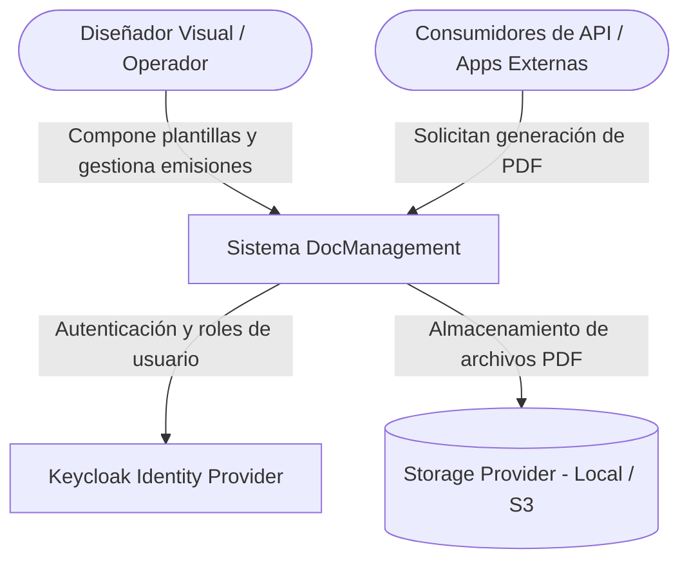
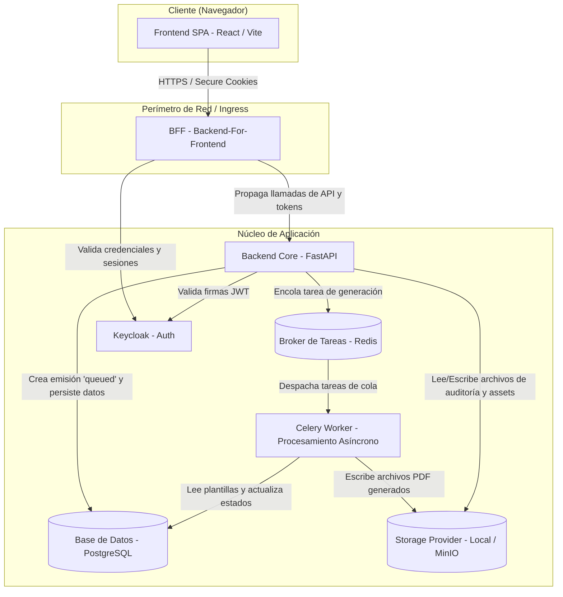
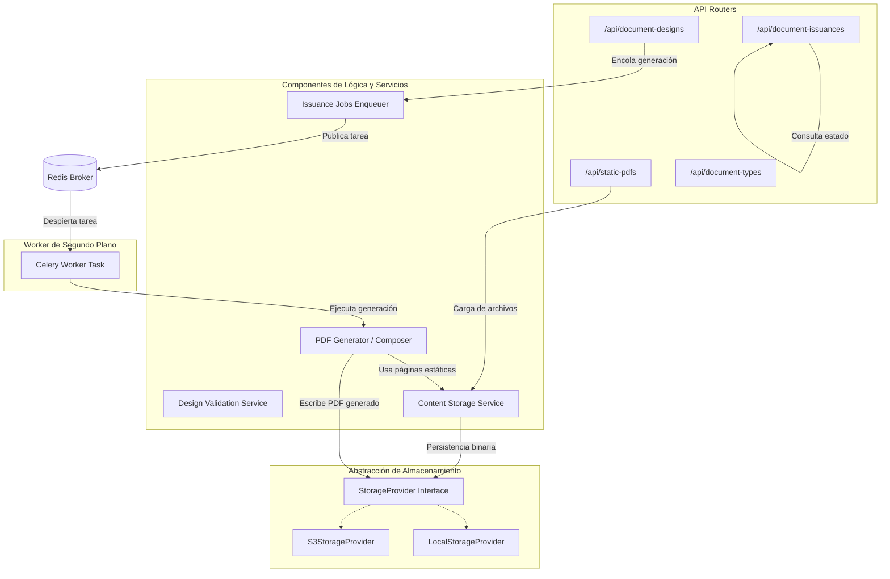
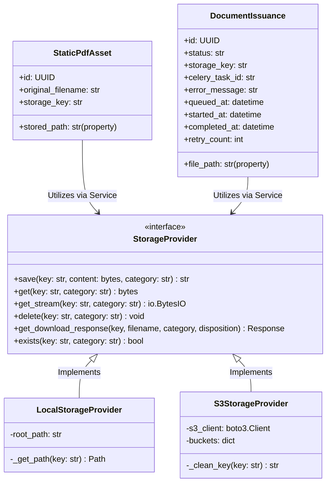

# Arquitectura de la Solución (Modelo C4)

Este documento detalla la arquitectura de software del sistema de Gestión de Plantillas y Emisión de Documentos (**DocManagement**) estructurada según el modelo **C4** (Contexto, Contenedores, Componentes y Código).

---

## 1. Nivel 1: Contexto de Sistema (Context)

El diagrama de contexto muestra cómo interactúan los usuarios y sistemas externos con la plataforma **DocManagement**.

### Elementos del Contexto
* **Operador / Diseñador**: Usuarios internos que diseñan las plantillas, definen metadatos y revisan el historial de emisiones de documentos.
* **Consumidores de API**: Sistemas clientes que solicitan la generación automatizada de documentos en PDF enviando payloads JSON con los datos requeridos.
* **Keycloak**: Proveedor OIDC que maneja la autenticación segura, emisión de tokens y definición de roles.
* **Storage Provider**: Abstracción del almacenamiento físico de los activos PDF estáticos y documentos generados (sistemas de archivos locales o buckets compatibles con AWS S3/MinIO).

---

## 2. Nivel 2: Contenedores (Container)

Este nivel detalla los componentes lógicos que conforman la aplicación, incluyendo el motor de procesamiento asíncrono.

### Contenedores Principales
1. **Frontend (React + Vite)**: Aplicación de página única (SPA) que expone el diseñador de plantillas, la biblioteca de documentos y el panel de monitoreo de trabajos.
2. **BFF (Backend for Frontend - FastAPI)**: Administra las cookies de sesión seguras (`HttpOnly`, `SameSite`) e intermedia las llamadas de la SPA hacia el backend.
3. **Backend Core (FastAPI)**: Valida solicitudes, expone APIs REST y gestiona la cola de encolamiento de trabajos.
4. **Redis (Broker/Queue)**: Canal/cola en memoria utilizado para coordinar de forma segura el despacho de tareas hacia los workers.
5. **Celery Worker**: Proceso en segundo plano que consume las tareas de Redis, renderiza los PDFs asíncronamente y actualiza el estado de las emisiones en la BD.
6. **PostgreSQL**: Base de datos relacional para persistencia de modelos (diseños, tipos de documentos, trazas de auditoría).
7. **Storage Provider**: Gestiona el ciclo de vida de los PDFs estáticos y generados.

---

## 3. Nivel 3: Componentes (Component)

Detalle de los componentes internos del contenedor del **Backend Core** y del **Worker**.

### Componentes Clave
* **API Routers**: Módulos de endpoints FastAPI que manejan la autenticación, parseo de inputs, validación previa del payload y formato de respuestas.
* **Issuance Jobs Enqueuer**: Componente que encola tareas asíncronas de generación enviando identificadores hacia el broker Redis.
* **Celery Worker Task**: Proceso que ejecuta la generación del documento compuesto consumiendo los datos desde la BD relacional y controlando los estados transicionales (`queued -> processing -> success/failure`).
* **PDF Generator / Composer**: Encargado de leer los layouts de los diseños, renderizar plantillas Jinja2 HTML a PDF y combinar páginas estáticas.
* **StorageProvider**: Interface abstracta para desacoplar el almacenamiento físico de archivos binarios.

---

## 4. Nivel 4: Código (Code)

Esquema detallado de clases de la abstracción de almacenamiento y composición de documentos.

### Notas de Implementación
* **Propiedades Compatibles**: Los modelos `StaticPdfAsset` y `DocumentIssuance` utilizan getters/setters `@property` para mantener compatibilidad hacia atrás con los campos heredados `stored_path` y `file_path`, mapeándolos dinámicamente hacia `storage_key` y resolviendo rutas cuando se opera con el proveedor local.
* **Método Exists**: La interfaz `StorageProvider` incluye el método `exists(key, category)` para que los endpoints de descarga e historial de auditoría validen la presencia física de los binarios antes de despachar respuestas o registrar trazas de descarga.
* **Campos Asíncronos**: El modelo `DocumentIssuance` almacena los metadatos de sincronización de Celery (`celery_task_id`, `error_message`, `queued_at`, `started_at`, `completed_at`, `retry_count`) para que el panel de monitoreo de trabajos exponga métricas exactas de duración y reintentos.
