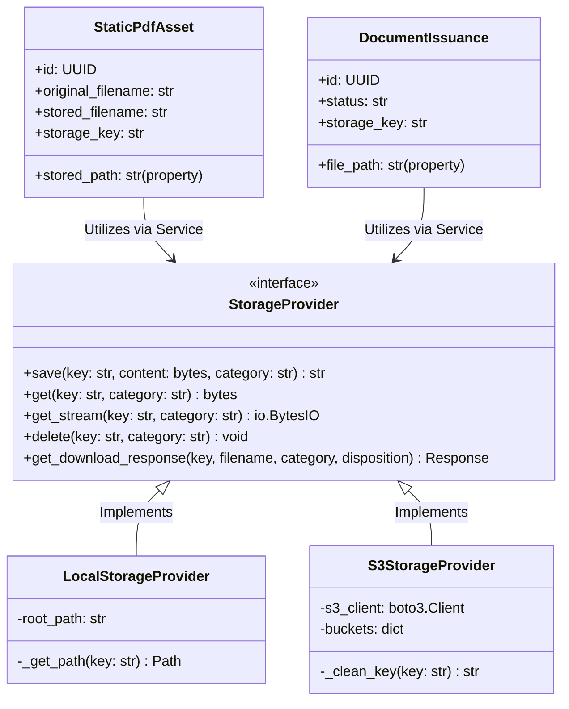

# Arquitectura de la Solución (Modelo C4)

Este documento detalla la arquitectura de software del sistema de Gestión de Plantillas y Emisión de Documentos (**DocManagement**) estructurada según el modelo **C4** (Contexto, Contenedores, Componentes y Código).

---

## 1. Nivel 1: Contexto de Sistema (Context)

El diagrama de contexto muestra cómo interactúan los usuarios y sistemas externos con la plataforma **DocManagement**.


### Elementos del Contexto
* **Operador / Diseñador**: Usuarios internos que diseñan las plantillas, definen metadatos y revisan el historial de emisiones de documentos.
* **Consumidores de API**: Sistemas clientes que solicitan la generación automatizada de documentos en PDF enviando payloads JSON con los datos requeridos.
* **Keycloak**: Proveedor OIDC que maneja la autenticación segura, emisión de tokens y definición de roles.
* **Storage Provider**: Abstracción del almacenamiento físico de los activos PDF estáticos y documentos generados (sistemas de archivos locales o buckets compatibles con AWS S3/MinIO).

---

## 2. Nivel 2: Contenedores (Container)

Este nivel detalla los componentes lógicos que conforman la aplicación y cómo se comunican entre sí.

```mermaid
graph TB
    subgraph Cliente (Navegador)
        SPA[Frontend SPA - React / Vite]
    end

    subgraph Perímetro de Red / Ingress
        BFF[BFF - Backend-For-Frontend]
    end

    subgraph Núcleo de Aplicación
        Backend[Backend Core - FastAPI]
        Keycloak[Keycloak - Auth]
        DB[(Base de Datos - PostgreSQL)]
        Storage[(Storage Provider - Local / MinIO)]
    end

    SPA -->|HTTPS / Secure Cookies| BFF
    BFF -->|Propaga llamadas de API y tokens| Backend
    BFF -->|Valida credenciales y sesiones| Keycloak
    Backend -->|Valida firmas JWT| Keycloak
    Backend -->|Persistencia relacional| DB
    Backend -->|Lee/Escribe archivos PDF| Storage
```

### Contenedores Principales
1. **Frontend (React + Vite)**: Aplicación de página única (SPA) que expone el diseñador visual de plantillas y el monitor de emisiones.
2. **BFF (Backend for Frontend - FastAPI)**: Actúa como pasarela de seguridad. Administra las cookies de sesión seguras (`HttpOnly`, `SameSite`) de Keycloak e intercepta y delega las solicitudes de la SPA hacia el backend.
3. **Backend Core (FastAPI)**: Expone las APIs REST del dominio de negocio (gestión de plantillas, composición de PDFs y lógica de emisiones).
4. **PostgreSQL**: Base de datos relacional para persistencia de modelos (diseños, tipos de documentos, trazas de auditoría).
5. **Storage Provider**: Gestiona el ciclo de vida de los PDFs estáticos y generados.

---

## 3. Nivel 3: Componentes (Component)

Detalle de los componentes internos del contenedor del **Backend Core**.

```mermaid
graph DP
    subgraph API Routers
        R1[/api/static-pdfs]
        R2[/api/document-types]
        R3[/api/document-designs]
        R4[/api/document-issuances]
    end

    subgraph Componentes de Lógica y Servicios
        Validation[Design Validation Service]
        Composer[PDF Generator / Composer]
        StorageService[Content Storage Service]
    end

    subgraph Abstracción de Almacenamiento
        base[StorageProvider Interface]
        local[LocalStorageProvider]
        s3[S3StorageProvider]
    end

    R1 -->|Carga de archivos| StorageService
    R3 -->|Previsualiza/Genera| Composer
    R4 -->|Solicita PDF| Composer
    Composer -->|Usa páginas estáticas| StorageService
    StorageService -->|Persistencia binaria| base
    Composer -->|Escribe PDF generado| base
    base -.-> local
    base -.-> s3
```

### Componentes Clave
* **API Routers**: Módulos de endpoints FastAPI que manejan la autenticación, parseo de inputs y formato de respuestas.
* **PDF Generator / Composer**: Encargado de leer los layouts de los diseños, renderizar plantillas Jinja2 HTML a PDF usando motores como `xhtml2pdf`/`weasyprint` y combinar páginas estáticas.
* **StorageProvider**: Interface abstracta para desacoplar el motor de base de datos de la ruta física de los archivos, permitiendo alternar entre sistema de archivos local (`LocalStorageProvider`) y buckets S3 (`S3StorageProvider`).

---

## 4. Nivel 4: Código (Code)

Esquema detallado de clases de la abstracción de almacenamiento y composición de documentos.



### Notas de Implementación
* **Propiedades Compatibles**: Los modelos `StaticPdfAsset` y `DocumentIssuance` utilizan getters/setters `@property` para mantener compatibilidad hacia atrás con los campos heredados `stored_path` y `file_path`, mapeándolos dinámicamente hacia `storage_key` y resolviendo rutas cuando se opera con el proveedor local.
* **Clean Keys**: El proveedor de S3 implementa una limpieza de ruta (`_clean_key`) para aislar solo el nombre base de archivo (`filename.pdf`) y evitar la creación de directorios virtuales redundantes dentro de los buckets.
