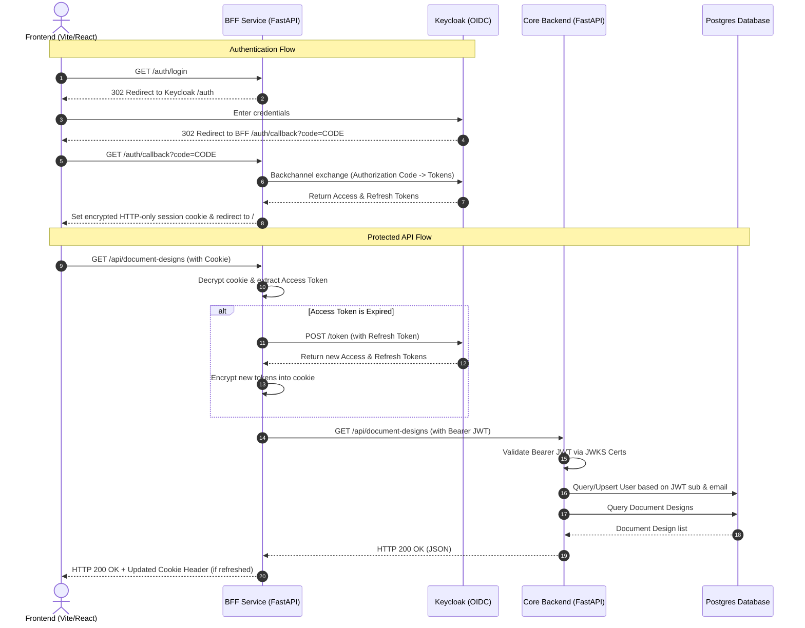

# Phase 11: BFF Component (Frontend/Backend Isolation) - Research

## Goal & Objectives
The goal of this phase is to introduce a **Backend For Frontend (BFF)** component between the React frontend and the core backend. This will isolate the core business logic (document types, visual design, template rendering, and PDF generation) inside a secure, stateless **Core Backend**, while moving authentication, OIDC handshakes, and session cookie management to the **BFF**.

By implementing the BFF pattern:
- The frontend (browser) will **never** interact directly with the Core Backend.
- The frontend will only communicate with the BFF using a secure, HTTP-only, SameSite session cookie.
- The Core Backend will be completely isolated, stateless with respect to browser sessions, and only accept standard **OAuth2/OIDC Bearer tokens** (`Authorization: Bearer <JWT>`) validated via JWKS.
- Cross-Site Scripting (XSS) risks are minimized since tokens are not exposed to the browser's JavaScript space (e.g., `localStorage`).

---

## Proposed System Architecture

The following diagram illustrates the updated architecture and request flow:



### Component Port Mapping & Network Layout
- **Frontend:** Port `5173` (no changes, continues to run Vite dev server locally).
- **BFF:** Port `8000` (takes over the port previously occupied by the backend). Exposed to `localhost`.
- **Core Backend:** Port `8001` (moved from port `8000`). Only exposed internally to the Docker bridge network and optionally `127.0.0.1:8001` for debugging/testing.
- **Keycloak:** Port `8080`.
- **Postgres:** Port `5432`.

---

## BFF Technical Stack & Implementation

We recommend writing the BFF in **Python (FastAPI)** to match the language, tools, and package manager (`uv`) of the current backend. This allows sharing configuration patterns, Dockerfile structures, and developer workflows.

### 1. BFF Folder Structure
A new service folder `./bff` will be created at the repository root:
```
bff/
├── app/
│   ├── __init__.py
│   ├── main.py          # FastAPI application, route inclusion, proxy middleware
│   ├── config.py        # BFF configurations (backend URL, Keycloak secrets, session key)
│   ├── auth/
│   │   ├── routes.py    # OIDC login, callback, and logout endpoints
│   │   └── session.py   # Encrypted cookie session utilities
│   └── proxy/
│       └── router.py    # HTTPx reverse proxy logic for /api/* calls
├── Dockerfile           # Docker container configuration
└── pyproject.toml       # Python package configuration with uv lockfile
```

### 2. Encrypted Cookie Session Utility
The BFF will store the OIDC tokens in an encrypted session cookie. Rather than maintaining a database in the BFF, we use **stateless encrypted cookies** using Starlette's `SessionMiddleware` (which relies on `itsdangerous` to sign and encrypt cookies) or a custom Fernet encryption wrapper.
This ensures the BFF remains 100% stateless and horizontal scaling requires no shared state databases.

### 3. Transparent Reverse Proxy Mechanics
For any request matching `/api/{path:path}` (except the dedicated BFF `/api/health` check), the BFF will proxy the request to the Core Backend (`http://backend:8001` inside Docker).
To handle downloads, uploads, and large payloads efficiently without high memory overhead:
- Use `httpx.AsyncClient` to perform async HTTP proxying.
- Implement response streaming for files:
```python
from fastapi import Request, Response
from fastapi.responses import StreamingResponse
import httpx

async def proxy_request(request: Request, path: str, access_token: str | None):
    # Construct target URL
    target_url = f"http://backend:8001/api/{path}"
    
    # Extract original headers, query parameters, method, and body
    headers = dict(request.headers)
    headers.pop("host", None)
    headers.pop("cookie", None)  # Do not forward browser cookies to internal core
    
    # Inject verified bearer token
    if access_token:
        headers["authorization"] = f"Bearer {access_token}"
    else:
        headers.pop("authorization", None)

    async with httpx.AsyncClient() as client:
        # Use streaming for response bodies
        req = client.build_request(
            method=request.method,
            url=target_url,
            headers=headers,
            params=request.query_params,
            content=request.stream()
        )
        resp = await client.send(req, stream=True)
        
        # Propagate backend headers and status
        return StreamingResponse(
            resp.aiter_raw(),
            status_code=resp.status_code,
            headers=dict(resp.headers)
        )
```

---

## Core Backend Isolation Changes

The Core Backend no longer manages OIDC authorization code exchanges, user sessions, or browser cookies. It is simplified as follows:

### 1. Stateless Authentication Dependency
All endpoints that previously used `Depends(get_current_user)` (which checked cookie sessions) will continue to work without modification by updating `get_current_user` in [dependencies.py](file:///D:/02-PERSONAL/01-PROJECTS/29-DocManagemet/backend/app/auth/dependencies.py):
```python
def get_current_user(
    db: SQLAlchemySession = Depends(get_db),
    token_claims: dict = Depends(verify_bearer_token_dep)
) -> User:
    """Resolves the user from the verified Bearer token claims.
    
    Automatically syncs user records in Postgres when new/updated profiles
    arrive from Keycloak via the BFF.
    """
    sub = token_claims.get("sub")
    email = token_claims.get("email")
    if not sub or not email:
        raise HTTPException(status_code=401, detail="Invalid token claims")
    return upsert_user(db, sub=sub, email=email)
```
- The database `sessions` table is no longer queried or written to by the backend code. We can retain the migration for structural history but delete its code usage.

### 2. Main Entry Point Simplification
- In [main.py](file:///D:/02-PERSONAL/01-PROJECTS/29-DocManagemet/backend/app/main.py), remove `SessionMiddleware` since no cookies are generated or parsed.
- Remove `auth_router` registration (`app.include_router(auth_router)`) since OIDC routes are now owned by the BFF.

---

## Testing Strategy Adjustments

### 1. Core Backend Unit & Integration Tests
Currently, backend tests authenticate by mocking database session inserts and setting cookies in the `TestClient`.
- **Change:** We must update the `client` fixture (or configure a request header override) in [conftest.py](file:///D:/02-PERSONAL/01-PROJECTS/29-DocManagemet/backend/tests/conftest.py) to automatically sign a mock JWT using the existing `mint_test_jwt` helper and append it as `Authorization: Bearer <JWT>` to test requests.
- This allows the entire backend test suite to continue running without live Keycloak dependencies or cookie session mockups.

### 2. BFF Verification Tests
A small suite of unit tests should be added to the new `./bff` directory to verify:
- OIDC redirect url generation.
- Session cookie decryption and token extraction.
- HTTP proxy routing, specifically ensuring headers are forwarded and target URLs are constructed correctly.
- Silent token renewal when an expired access token is presented alongside a valid refresh token.

---

## Pitfalls & Mitigation

| Pitfall | Risk | Mitigation |
|---------|------|------------|
| **Cookie Size Overflow** | OIDC JWT tokens (access + refresh + ID tokens) can be large. Browsers reject cookies exceeding 4KB, causing silent auth dropouts. | 1. Keep Keycloak token scope minimal.<br>2. Compress token payloads before encrypting.<br>3. If tokens still exceed 4KB, implement session chunking (e.g. splitting into `session_1`, `session_2`) or use a server-side cache (Redis/Memory) in the BFF, storing only the session ID in the cookie. |
| **CSRF Vulnerability** | Introducing cookie-based authentication for browser API requests re-opens the system to Cross-Site Request Forgery (CSRF). | 1. Configure the session cookie with `SameSite="Lax"` (or `Strict` where applicable) and `Secure; HttpOnly`.<br>2. Verify the `Origin` and `Referer` headers on mutating requests (`POST`/`PUT`/`PATCH`/`DELETE`) in the BFF.<br>3. Alternatively, implement a simple anti-CSRF token middleware inside the BFF. |
| **Multipart Upload Buffering** | Large files (e.g., static PDFs) uploaded via the designer could buffer in the BFF's memory before reaching the backend, causing memory spikes. | Ensure the BFF proxy middleware streams the request payload directly to the backend (`content=request.stream()`) instead of reading it in memory via `await request.body()`. |
| **Silent Expiry Failures** | If the refresh token is expired or revoked, token renewal fails silently, resulting in broken API responses. | Catch token refresh failures in the proxy middleware and return a clean HTTP `401 Unauthorized` with a clear message, instructing the frontend to redirect the user back to `/auth/login`. |

---

## Open Decisions to Align Before Planning

### 1. Stateless Cookie vs Stateful BFF Sessions
- **Stateless Cookies (Recommended):** Encrypt access + refresh tokens directly in the cookie payload. This is easy to scale and doesn't require databases for the BFF.
- **Stateful BFF (Alternative):** Store tokens in Redis or an SQLite database in the BFF, returning only a session ID to the client. This is safer if token payloads are too large for browser cookies.
- *Recommendation:* Start with Stateless Cookies using compression, as Keycloak default dev tokens are small.

### 2. Shared User Table vs Independent Sync
- **Current DB sharing:** The BFF and Core Backend can share the same Postgres instance, but the BFF only reads configuration (frontend origins, OIDC urls). It doesn't need database access if cookie sessions are stateless.
- *Recommendation:* Keep the database strictly attached to the Core Backend. The BFF should have zero database connections. This reinforces the core isolation goal.

---
## RESEARCH COMPLETE
